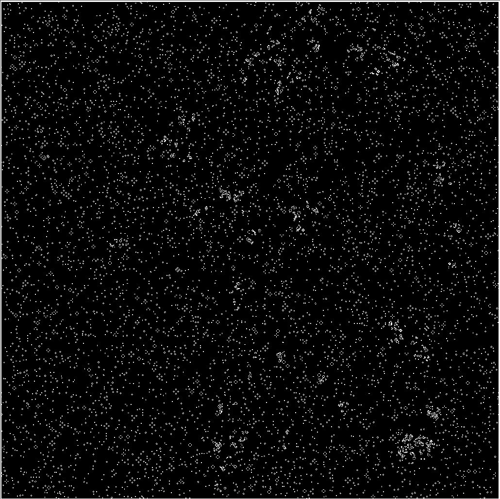

# conway's game of life shader



Implementation of conway's game of life using a fragment shader, running in
webgl.

Credit goes to [this post](https://nullprogram.com/blog/2014/06/10/) which I
followed very closely, except I used webGL APIs directly instead of a helper
library.

## how to run

Host the files statically any way you want

```
npx http-server . &
open https://localhost:8080
```
